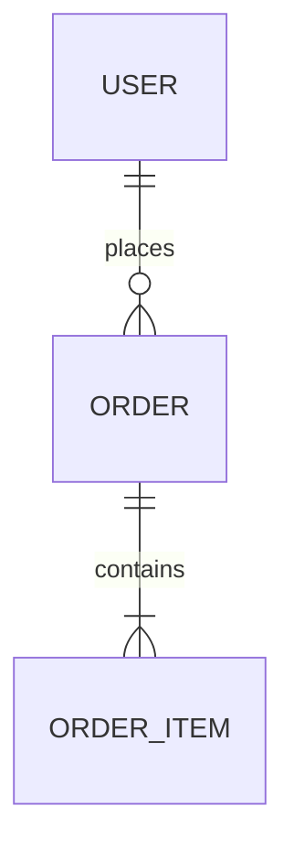
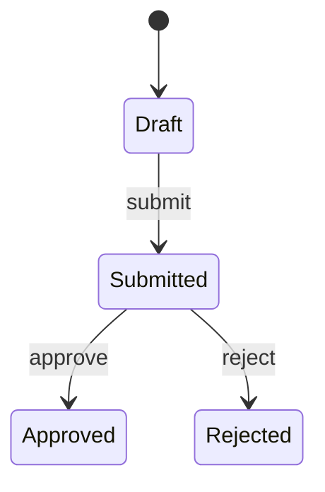
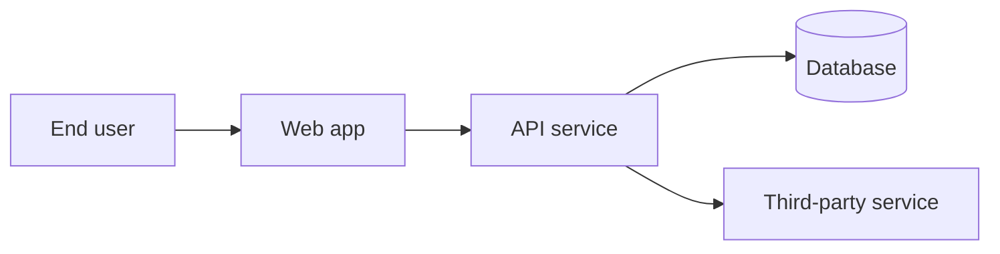
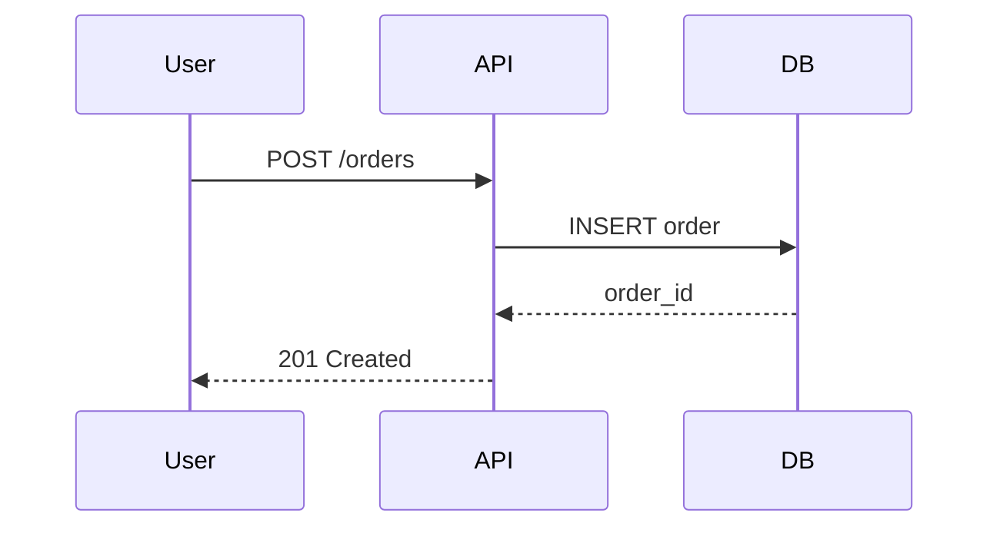
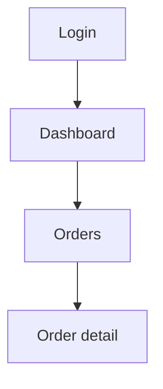

# Output Document Template

The skeleton for the single `.md` deliverable. Keep the section order. Section 0 is mandatory in every document - write it last, place it first, and keep it free of jargon. Drop a section only when it is genuinely irrelevant to the system, and add a one-line note saying it was dropped and why. Replace every `<placeholder>`; never ship a placeholder.

---

```markdown
# <System Name> - Analysis & Design Document

| Field | Value |
| --- | --- |
| Version | 1.0 |
| Date | <YYYY-MM-DD> |
| Author | <author> |
| Status | Draft / In Review / Approved |
| Audience | Section 0: anyone. Sections 1+: Product, Engineering, QA |

## Table of Contents
<links to every H2>

---

## 0. Executive Summary

> Written last, placed first. One page, plain language, no technical background required. It must make sense to someone who reads nothing else.

### 0.1 What we are building
<2-3 sentences: what it is, who uses it, what it replaces.>

### 0.2 The problem it removes
<2-3 sentences in the reader's own terms: what goes wrong today and what that costs in time, money or mistakes.>

### 0.3 How it works
<4-6 sentences walking through the main flow the way you would explain it to the person who will actually use it. Add one simple Mermaid flowchart only if it genuinely helps.>

### 0.4 What ships first

| | |
| --- | --- |
| Version 1 includes | <plain list of capabilities, no IDs> |
| Version 1 does NOT include | <plain list, and when each one comes instead> |
| First usable version | <date, or "week N"> |

### 0.5 The decisions that shape everything

| Decision | In plain terms | Why this way |
| --- | --- | --- |
| <e.g. Web app rather than a mobile app> | <staff open it in a browser on any device; nothing to install or update> | <reason tied to their situation> |

### 0.6 Time, effort and cost

| | |
| --- | --- |
| Total effort | <person-weeks> |
| Timeline | <phases with dates> |
| Team needed | <roles> |
| Running cost | <per month, and what pushes it up> |

### 0.7 Top 3 risks

| Risk | What it means for you | What we do about it |
| --- | --- | --- |

### 0.8 What we need from you
<The decisions the reader must make, as plain questions with concrete options and a deadline for each. Mirrors section 16 - keep the two in sync.>

---

## 1. Problem & Vision

### 1.1 The idea
<3-5 sentences. What is being built, for whom, and why it should exist.>

### 1.2 The problem today
<How the target user solves this now, and what that costs them - time, money, errors, risk.>

### 1.3 Vision & success metrics
<What "solved" looks like in 12 months, plus 3-5 measurable success metrics with targets.>

| Metric | Baseline | Target | Measured by |
| --- | --- | --- | --- |

### 1.4 Assumptions
<Every default chosen instead of asked about. One line each, numbered A-01, A-02, ...>

---

## 2. Scope

### 2.1 In scope
<Bulleted capability list for this release.>

### 2.2 Out of scope
<Explicitly excluded, with a one-line reason for each. This section prevents rework.>

### 2.3 Stakeholders & actors

| Actor | Type | Goal | Key interactions |
| --- | --- | --- | --- |
| <name> | Human / System | <what they want> | <what they do> |

---

## 3. Requirements

### 3.1 Functional requirements

| ID | Requirement | Priority | Actor | Acceptance |
| --- | --- | --- | --- | --- |
| FR-01 | The system shall <testable behaviour>. | Must / Should / Could | <actor> | <how it is verified> |

Group by module when the list exceeds ~15 rows.

### 3.2 Non-functional requirements

| ID | Category | Requirement (with a number) | Verification |
| --- | --- | --- | --- |
| NFR-01 | Performance | p95 API latency < 300 ms at 500 concurrent users | k6 load test |
| NFR-02 | Availability | 99.5% monthly uptime; RTO 4h, RPO 1h | Chaos + restore drill |
| NFR-03 | Scalability | 100k records year 1, 3x growth year 2 | Capacity plan |
| NFR-04 | Security | <standard / regime> | Pen test |
| NFR-05 | Usability | Core task in <= 3 clicks, WCAG 2.1 AA | UAT |

### 3.3 Use cases

For each significant flow:

**UC-01 - <name>**
- Actor: <actor>
- Precondition: <state before>
- Main flow: <numbered steps>
- Alternate / exception flows: <numbered>
- Postcondition: <state after>
- Covers: FR-01, FR-04

### 3.4 Business rules & constraints

| ID | Rule / constraint | Rationale | Impacts |
| --- | --- | --- | --- |
| BR-01 | <rule> | <why> | FR-xx |

---

## 4. Domain Model

### 4.1 Entities
<Entity list: purpose, key attributes, invariants.>

### 4.2 Entity relationships


*Caption: what the reader should notice - cardinalities, ownership, the aggregate roots.*

### 4.3 Lifecycles


*Caption: which transitions are irreversible and who is allowed to trigger each.*

### 4.4 Glossary

| Term | Meaning |
| --- | --- |

---

## 5. System Architecture

### 5.1 Chosen style & justification
<Style, and the 2-3 forces that made it the right call for this team, budget and load. Reference the NFR IDs it satisfies.>

### 5.2 Technology stack

Agreed with the user in the tech stack round. Every row carries a pinned version and a reason a non-technical reader can follow. Mark any row the user chose against the recommendation, and state what that costs.

| Layer | Technology | Version | Why this, in plain terms | Status |
| --- | --- | --- | --- | --- |
| Frontend | | | | Agreed / Overridden / Assumed |
| Mobile | | | | |
| Backend | | | | |
| Database | | | | |
| Cache / queue | | | | |
| File storage | | | | |
| Login / identity | | | | |
| Third-party services | | | | |
| Hosting | | | | |
| CI/CD | | | | |
| Monitoring & backups | | | | |

**Rejected alternatives:** <one line each, why not. The contested ones get a full ADR in section 15.>

**Cost of ownership:** <monthly cost at launch and at 10x load, who patches each piece, how hard it is to hire for.>

**Lock-in:** <anything expensive to reverse later - managed database, proprietary auth, cloud-specific service, a paid third party in the critical path - and roughly what leaving would cost.>

### 5.3 Context diagram


*Caption: the system boundary and every external dependency crossing it.*

### 5.4 Components

| Component | Responsibility | Depends on | Covers |
| --- | --- | --- | --- |
| <name> | <single responsibility> | <deps> | FR-xx |

### 5.5 Key interactions


*Caption: where the transaction boundary sits and what happens on partial failure.*

### 5.6 Sync vs async boundaries
<What runs in-request, what is queued, why - with the retry and dead-letter policy for each queue.>

---

## 6. Data Design

### 6.1 Schema

```sql
CREATE TABLE orders (
    id            BIGSERIAL PRIMARY KEY,
    user_id       BIGINT NOT NULL REFERENCES users(id),
    status        VARCHAR(20) NOT NULL DEFAULT 'draft',
    total_amount  DECIMAL(12,2) NOT NULL,
    created_at    TIMESTAMPTZ NOT NULL DEFAULT now()
);
```

### 6.2 Indexes

| Index | Table | Columns | Query it serves |
| --- | --- | --- | --- |

### 6.3 Migration, seeding & data volume
<Migration tool, rollback approach, seed data, expected row counts and growth per table.>

### 6.4 Caching & archival
<What is cached, the key shape, TTL, invalidation trigger. What is archived and when.>

---

## 7. API Design

### 7.1 Conventions
<Base URL, versioning, auth header, pagination, filtering, sorting, date format, idempotency keys, rate limits.>

### 7.2 Endpoints

| Method | Path | Auth | Purpose | Success | Errors | Covers |
| --- | --- | --- | --- | --- | --- | --- |
| POST | /api/v1/orders | Bearer | Create an order | 201 | 400, 401, 422 | FR-03 |

### 7.3 Payload examples

```json
{ "request": {}, "response": {} }
```

### 7.4 Error taxonomy

| Code | HTTP | Meaning | Client action |
| --- | --- | --- | --- |
| ORDER_INVALID_ITEM | 422 | Item is unavailable | Show field error |

### 7.5 Events / webhooks

| Event | Trigger | Payload | Consumers | Delivery guarantee |
| --- | --- | --- | --- | --- |

---

## 8. UI/UX Design

### 8.1 Screen inventory

| Screen | Purpose | Actor | Key elements | Covers |
| --- | --- | --- | --- | --- |

### 8.2 Navigation map


*Caption: the entry points and how deep the critical task sits.*

### 8.3 Critical flows
<For each of the 2-3 most important flows: step-by-step screens, decision points, what the user sees on success and on failure.>

### 8.4 States & responsiveness
<Empty, loading, error, permission-denied states. Breakpoints. Accessibility baseline.>

---

## 9. Cross-Cutting Concerns

### 9.1 Authentication & authorisation
<Mechanism, token lifetime, refresh, session handling.>

| Role | Permissions |
| --- | --- |

### 9.2 Validation
<Client, API and database validation layers, and which one is authoritative.>

### 9.3 Observability
<Log format and levels, metrics collected, traces, alert thresholds and who they page.>

### 9.4 Configuration & secrets

| Variable | Purpose | Example | Secret? |
| --- | --- | --- | --- |

### 9.5 Internationalisation & feature flags
<Only if applicable; otherwise state that it is deliberately not supported.>

---

## 10. Security

### 10.1 Threat model

| # | Threat | Category | Impact | Mitigation |
| --- | --- | --- | --- | --- |
| T-01 | <threat> | Spoofing / Tampering / Repudiation / Info disclosure / DoS / Elevation | H/M/L | <control> |

### 10.2 Data classification & PII

| Data | Classification | At rest | In transit | Retention |
| --- | --- | --- | --- | --- |

---

## 11. Deployment & Operations

### 11.1 Environments

| Environment | Purpose | Data | Deploy trigger |
| --- | --- | --- | --- |

### 11.2 CI/CD pipeline
<Stages in order, with the gate at each stage.>

### 11.3 Infrastructure & scaling
<Topology, instance sizing, scaling triggers, single points of failure.>

### 11.4 Backup & disaster recovery
<Backup frequency, storage, restore procedure, tested how often. Must satisfy the RTO/RPO in NFRs.>

### 11.5 Cost estimate

| Item | Monthly cost | Notes |
| --- | --- | --- |

---

## 12. Testing Strategy

| Level | Scope | Tooling | Target |
| --- | --- | --- | --- |
| Unit | <what> | | <coverage %> |
| Integration | | | |
| E2E | <critical flows> | | |
| Load | <NFR-01 scenario> | | |
| UAT | <who signs off> | | |

---

## 13. Delivery Plan

### 13.1 MVP cut line
<Exactly what ships in v1 and what waits. One paragraph, unambiguous.>

### 13.2 Roadmap

| Phase | Scope (FR IDs) | Deliverable | Effort | Dependencies |
| --- | --- | --- | --- | --- |
| Phase 1 - MVP | FR-01..FR-08 | | <person-weeks> | |

### 13.3 Team & dependencies
<Roles needed, external dependencies, procurement or access that must be arranged early.>

---

## 14. Risks

| ID | Risk | Probability | Impact | Mitigation | Owner |
| --- | --- | --- | --- | --- | --- |
| R-01 | | H/M/L | H/M/L | | |

---

## 15. Architecture Decision Records

**ADR-01 - <decision title>**
- Context: <the forces at play>
- Decision: <what was chosen>
- Consequences: <what this makes easy, and what it makes hard>
- Rejected: <option> - <one-line why not>

---

## 16. Open Questions

Every question here must be answerable by a non-technical stakeholder from what they already know about their own business: no jargon, always with concrete options, and a note on what changes depending on the answer. Anything only an engineer could answer is not an open question - decide it, and record it under Assumptions or as an ADR.

| ID | Question (plain language) | Options | Why it matters | Blocks | Owner | Needed by |
| --- | --- | --- | --- | --- | --- | --- |
| Q-01 | <e.g. "Should customers pay inside the app, or keep paying by bank transfer the way they do now?"> | A) Card payment in the app  B) Bank transfer, staff confirms by hand | <what changes in time, cost or effort depending on the answer> | FR-xx / Phase 1 | | |

---

## 17. Traceability Matrix

| Requirement | Component | Endpoint | Screen | Test |
| --- | --- | --- | --- | --- |
| FR-01 | | | | |
```
