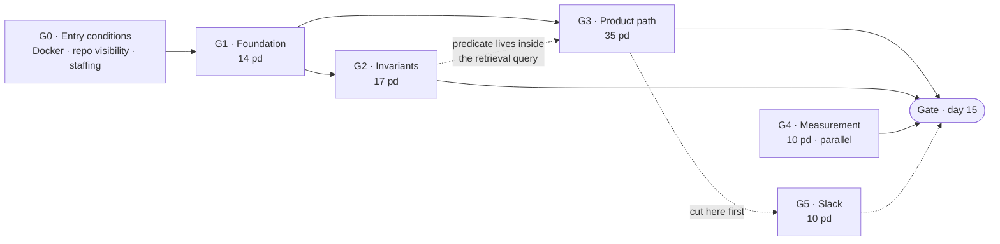

# Ei-AI — Phase 1 · Overview by priority

> The top layer of the Phase 1 plan. Three layers in all: this document, then [Detail](./ei-ai-phase-1-detail.md) (20 work packages), then [Tasks](./ei-ai-phase-1-tasks.md) (149 tasks whose hours sum back to the packages). Groups every piece of week 1–3 work by **what breaks if it slips**, so that when time runs short the cut is already decided. The work packages behind each group are in [Phase 1 in detail](./ei-ai-phase-1-detail.md); requirements are in the [system design](../design/ei-ai-agentic-knowledge-assistant.md), the machine and the stack in the [development environment](./ei-ai-dev-environment.md).

| Field | Value |
| --- | --- |
| Version | 0.1 — **draft for review** |
| Date | 2026-09-10 |
| Covers | Weeks 1–3 · FR-01, 02, 04, 05, 09, 10, 11, 45, 58, 61, 62, 64, 65, 66 · skeleton of FR-21, FR-75 |
| Budget in the top-level plan | 15 pw / 3 weeks |
| Measured bottom-up | **86 person-days ≈ 17 pw** — §6 says what to do about the difference |
| Milestone | `docker compose up` → log in → upload `.md` → search → cited passages, **no generated text** |

---

## 1. The milestone, in one paragraph

At the end of week 3 a person who has never seen the repository clones it, copies `.env.example`, runs `docker compose up`, logs in, creates a workspace, uploads a folder of Markdown files, watches them reach `indexed`, types a question and gets back the passages that actually contain the answer — with file name and position, and **not one sentence written by a model**. Meanwhile an outbound request from inside the API container fails at the proxy, and the proxy logs the denial.

That is the whole of Phase 1. Everything below is about the order in which it gets built and what gets dropped if the three weeks run out.

**The discipline that is easiest to break:** Phase 1 generates no text. The screen is labelled **"Search documents"**, not "Ask a question". A rough question-answering demo in week 3 buys applause and costs the whole of milestone 2C, which then has to argue against an expectation the team itself created.

---

## 2. How the priority groups were decided

Three questions, asked of every piece of work. The first "yes" fixes the group.

| # | Question | If yes | Group |
| --- | --- | --- | --- |
| 1 | Does anything else stop until this exists? | It is scaffolding — nobody can work around it | **G1** |
| 2 | Is it cheap today and structural later? | It goes in before the code that depends on it, not after | **G2** |
| 3 | Is it what the milestone demonstrates? | It is the vertical slice — the reason week 3 has a demo | **G3** |
| — | None of the above, and week 4 could absorb it | It is pre-agreed slack | **G5** |

The measurement lane (**G4**) sits outside the ladder: it blocks nobody and is blocked by nobody, but its results can change the plan, so it runs from day 1 in parallel.

**Why "cheap today, structural later" outranks the visible product.** Adding a column in week 2 costs minutes; adding it in week 20 costs days of migration on a live corpus. Putting the permission predicate into the retrieval query when there is one query costs nothing; adding it after four call sites exist means finding all four. Turning on default-deny egress before anyone has written a direct HTTP call costs nothing; turning it on in week 19 means unpicking every habit formed since week 1. G2 is not a security ritual — it is the cheapest moment to do work that only gets more expensive.

---

## 3. The five groups

| Group | Name | pd | Lanes | Can it be cut? |
| --- | --- | --- | --- | --- |
| **G1** | Foundation that blocks everything | 14 | DevOps, Lead | **No** — nothing else starts |
| **G2** | Safety invariants — cheap now, structural later | 17 | Lead, Backend 2, DevOps | **No** — scope may narrow, the invariant may not |
| **G3** | The product path — the vertical slice | 35 | Lead, Backend 2, Frontend | Partly — see G5 |
| **G4** | Measurement — the numbers that can change the plan | 10 | ML | No, but it never blocks code |
| **G5** | Pre-agreed slack — week 4 can absorb it | 10 | all | **Yes, first** |
| | **Total** | **86** | | |

### G1 · Foundation that blocks everything — 14 pd

**Contains:** the pnpm monorepo and pinned Dockerfiles; the Compose stack with the two-network egress split; the Dev Container; zod-validated config that refuses to boot on a missing variable; **every table in the database, for every phase**, as numbered forward-only SQL; the base CI pipeline (lint, typecheck, unit, build, migrate).

**Why here:** every other lane imports from this. A frontend developer cannot call an API that does not boot; a backend developer cannot write a repository against a schema that does not exist.

**Done when:** `docker compose up -d` brings the stack up on a clean machine, `\dt` lists every table including `write_snapshots`, and `ip route` inside the api container shows **no default route**.

**If it slips:** everything slips, one day for one day. This is the group to overstaff on day 1, not the one to economise on.

### G2 · Safety invariants — 17 pd

**Contains:** the five database defects fixed and the FR-44 constraint made real (detail §1.1); default-deny egress at the network layer with an empty allowlist that actually denies; the hybrid retrieval query with the **permission predicate inside the SQL**, in the one file allowed to touch `chunks`, with its predicate and leakage tests; append-only audit written inside the caller's transaction; the five architecture rules running in CI.

**Why here:** each of these is a promise the product is sold on, and each costs a fraction today of what it costs later. Three of them — the predicate, default-deny, and audit immutability — are also the items the Phase 1 gate cannot close without.

**Done when:** deleting the `permitted` join turns two tests red; an outbound request with the proxy environment **removed** still fails, and Squid logs `TCP_DENIED`; `UPDATE audit_events` raises rather than silently doing nothing; the database refuses to pre-authorise a write tool.

**If it slips:** it must not. The scope inside a package can narrow — for example the allowlist can be a static file in week 3 and generated from the database in week 4 (that split is already made: the generation half sits in G5) — but no invariant moves to Phase 2.

### G3 · The product path — 35 pd

**Contains:** local authentication with Argon2id, rotating single-use refresh tokens and lockout; five system roles and three workspace roles with a generated 77-case permission matrix; workspaces, upload of the 10 formats with content-type sniffing, and local-filesystem storage; the Markdown ingestion pipeline — chunk, embed, index — with character offsets preserved; the tool registry skeleton and the computed `document-only` operating mode; the web app: 19 routes, four of them real.

**Why here:** this is what the demo is. It is also the largest group, and the one whose estimate is least certain, which is exactly why the cuts in G5 were carved out of it in advance.

**Done when:** the milestone paragraph in §1 is literally true, end to end, on a clean machine.

**If it slips:** cut from G5 first. If G5 is exhausted, the honest move is to narrow the *formats* accepted at upload (Markdown and text only, others rejected with a clear message) rather than to weaken any part of G2.

### G4 · Measurement — 10 pd, parallel lane

**Contains:** the proxy corpus (30–50 scanned Vietnamese legal PDFs, 10–20 documents with real tables, a set of `.md` files, plus a hand-transcribed reference); the Docling + Tesseract OCR spike run out-of-band; the GPU benchmark — VRAM with both models loaded, embedding throughput, rerank latency.

**Why separate:** it touches no product code and blocks no one, but it produces the five numbers in §7 — and one of them, OCR accuracy, can change the product's scope. Below 90% triggers the R-01 fallback: commercial OCR at roughly $1.50 per 1,000 pages, or a narrower v1 format list stated plainly to the customer. **That decision belongs to week 3, not week 12.**

**Done when:** `docs/ops/week-1-measurements.md` holds all five numbers, each with the command or method that produced it, and an explicit R-01 recommendation.

### G5 · Pre-agreed slack — 10 pd

**Contains:** ZIP expansion on upload (the 500-file path); generating `allowlist.conf` from the database and reloading Squid; the document detail API and screen; CI stages 7–9 (Testcontainers integration, the empty red-team harness, security scan and GHCR push); contract tests for the `501` routes, the "coming soon" wireframes and the accessibility pass.

**Why here:** each one is visible, each one is genuinely useful, and none of them is load-bearing for anything in weeks 4–12. Deciding this **now**, in writing, is the entire point: a cut agreed in week 1 is a plan, the same cut improvised in week 3 is a quality problem.

**If capacity holds, none of this is cut.** It is the shock absorber, not a wish list.

---

## 4. How the groups depend on each other

The dotted line from G2 to G3 is the one worth reading twice: the permission predicate is not a checkpoint the product path passes through afterwards — it lives *inside* the retrieval query the product path calls. That is why it cannot be scheduled after the feature that uses it.

---

## 5. Three weeks, by group

> This is the shape of the work, not a commitment to three weeks — §6 says what the schedule actually costs. Under the recommended option the same three centres of gravity spread across four weeks.

| Week | Centre of gravity | Ends with |
| --- | --- | --- |
| **1** | **G1** in full, **G4** starts, G3's identity work begins behind it | Stack up, every table in, 19 routes render, first measurements taken |
| **2** | **G3** — upload, pipeline, auth, roles — with **G2**'s egress landing alongside | Log in, upload a `.md` folder, watch it reach `indexed`, empty allowlist denies |
| **3** | **G2**'s retrieval and audit close; **G3** finishes on screen; **G5** if there is room | Search returns cited passages; gate run on day 15 |

The day-level version of this table, five lanes across fifteen days, is §9 of the detail document.

---

## 6. Capacity — the one thing to settle before day 1

The top-level plan gives Phase 1 **15 pw over 3 weeks**, which implies five people full time. §9.1 of that same plan staffs weeks 1–3 with the tech lead, the frontend developer, the ML engineer and a part-time DevOps — **3.5 FTE, 52.5 pd**. The second backend starts in week 4.

| Lane | Work demanded | Capacity as staffed | With a second backend from day 1 |
| --- | --- | --- | --- |
| Backend | **52.5 pd** (lead 33 + second 19.5) | 15 pd | 30 pd |
| Frontend | 11.5 pd | 15 pd | 15 pd |
| ML | 10 pd | 15 pd | 15 pd |
| DevOps (0.5) | 12 pd | 7.5 pd | 7.5 pd |
| **Total** | **86 pd** | **52.5 pd** | **67.5 pd** |

Backend is short by 37.5 pd as staffed, and by 22.5 pd even with the second backend pulled forward. The per-lane figures are the sum of the individual tasks in [Phase 1 · Tasks](./ei-ai-phase-1-tasks.md), not a top-down allocation — which is why they do not round neatly.

### Schedule simulation

The 149 tasks were run through their dependency graph with eight-hour days and one worker per lane unless stated ([tasks §2](./ei-ai-phase-1-tasks.md)):

| Staffing | Finishes on day | ≈ weeks |
| --- | --- | --- |
| As staffed in the top-level plan §9.1 — 1 backend, 1 FE, 1 ML, DevOps modelled generously at full time | **55** | 11 |
| Second backend from day 1 | 32 | 6.5 |
| Three backends | 25 | 5 |
| Three backends, G5 deferred | 22 | 4.5 |
| **Four backends, G5 deferred** | **19** | **4** |
| Five backends, two frontends, G5 deferred | 16 | 3.2 |

**This corrects an earlier version of this section.** It claimed that a second backend from day 1 plus a third for weeks 2–3 would still close Phase 1 at the end of week 3. That does not hold: backend demand is 52.5 pd, three people across three weeks supply 45 pd at perfect utilisation with zero dependency idling, and the simulation — which accounts for the idling — puts that combination at day 25.

**The critical path is only 8.2 days**, so this is a volume problem, not a sequencing one. Three weeks cannot be bought with better ordering; it can only be bought with people or with scope.

| | Option | Gate lands | Cost |
| --- | --- | --- | --- |
| **A** *(recommended)* | **Four backend-capable people** (lead + 3), DevOps at full time in week 1, **G5 deferred** | **Day 19 — end of week 4** | One week of schedule, absorbed in Phase 2's nine weeks or in Phase 4 |
| **B** | The team as staffed, plus the second backend from day 1 | Day 32 — week 6.5 | Phase 1 more than doubles; the 26-week plan becomes roughly 30 |
| **C** | Four backends, **G5 plus about 12 pd out of G3** — web down to login and search only, upload narrowed to `.md`/`.txt`, document status API only | Day 15 — end of week 3 | The week-3 demo no longer demonstrates the milestone, and milestone 2A inherits the format work |

**Recommendation: A.** Option C holds the date by removing the thing the date was for — a demo that cannot accept a PDF or open a workspace screen does not prove that the foundation works. Option B is honest but expensive. A costs one week and keeps the gate meaningful.

DevOps is also short by 4.5 pd under every option — either raise them above half time for weeks 1–2, or the lead absorbs the Compose and CI work and the backend gap widens further.

---

## 7. Entry conditions and the numbers that come out

**Before day 1** — live status is in the [progress tracker](./ei-ai-progress.md) §2.1:

| # | Condition | State on 2026-09-10 |
| --- | --- | --- |
| E-1 | Source on ext4 in WSL2, repo clean and pushed | ✅ |
| E-2 | GPU visible from Ubuntu (RTX 3050 Ti, 4096 MiB) | ✅ |
| E-3 | WSL memory capped at 18 GB | ✅ |
| E-4 | Docker usable from Ubuntu | ✅ `docker ps` works from Ubuntu — Docker 29.4.3, Compose v5.1.3 |
| E-5 | Repository visibility decided | ✅ **public**, decided 2026-09-10 — personal research project |
| E-6 | Second backend available from day 1 | ❌ open — see §6 |

**After day 15** — five numbers, each of which can change the plan:

| # | Number | Changes what |
| --- | --- | --- |
| 1 | VRAM with both models loaded | Over ~3.6 GB → reranker to int8 or CPU |
| 2 | Embedding throughput, chunks/second | Realistic ingest time, and whether NFR-04 is reachable |
| 3 | **OCR accuracy on the proxy corpus** | **Below 90% → R-01 fallback, decided in week 3** |
| 4 | HMR latency | Over 3 seconds → the source is on the wrong filesystem |
| 5 | Empty-allowlist denial confirmed | If it does not deny, Phase 1 does not close |

---

## 8. The gate, in six lines

The full checklist with a proving command per line is §10 of the detail document. Compressed, Phase 1 closes when:

1. A clean machine runs `docker compose up` and reaches a working login with no step beyond copying `.env.example`.
2. Upload a `.md` folder → `indexed`, every chunk embedded, character offsets resolving exactly back to the source.
3. Search returns relevant passages with file name and position — and **no generated text exists anywhere in the codebase's execution path**.
4. The retrieval SQL provably contains the permission predicate, and user A receives none of user B's restricted chunks in results, logs or intermediate structures.
5. With an empty allowlist and the proxy environment removed, an outbound request from the api container fails at the network and Squid logs the denial.
6. CI is green on all nine stages, the permission matrix covers 77/77 role-action pairs, and the five measurements are written down.

---

## 9. Decisions this draft needs from you

| # | Question | Why it blocks |
| --- | --- | --- |
| ~~D-1~~ | ~~Public or private repository?~~ | **Decided 2026-09-10: public.** A personal research project, published deliberately. The standing constraint that follows is in [dev env §9.1](./ei-ai-dev-environment.md) step 1 — no corpus and no real customer document enters the tree |
| **D-2** | **Capacity — option A, B or C?** | It decides whether the day-15 gate is honest or aspirational |
| D-3 | Do you accept the G5 list as the pre-agreed cut? | If not, name what replaces it — the point is that the decision exists before week 3, not that it is mine |
| D-4 | Who commits 2 hours per week from week 4 for the golden set? | Not a Phase 1 blocker, but the ask has to be made **in week 3** to be honoured in week 4 |

The Anthropic API key is **not** on this list. Phase 1 makes no generation call, so it is first needed in week 7 — six weeks later than the top-level plan currently marks it.
